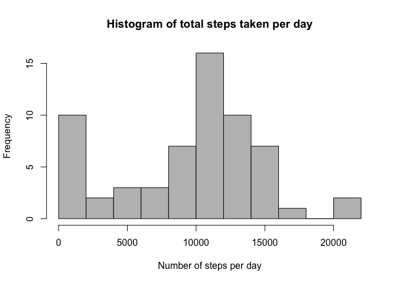
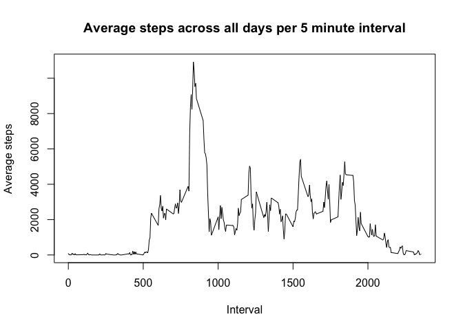
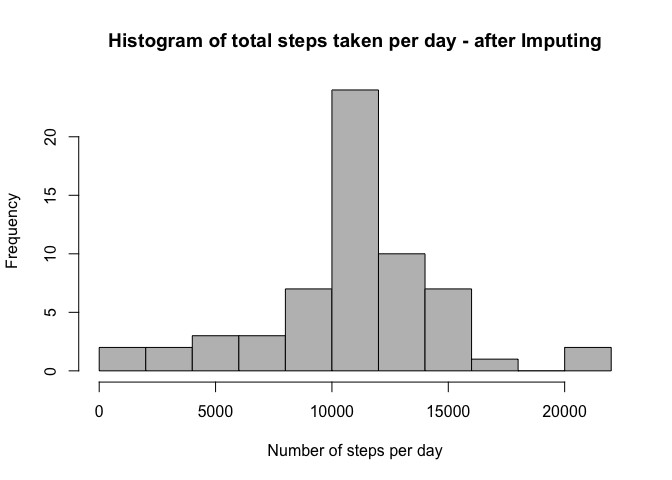
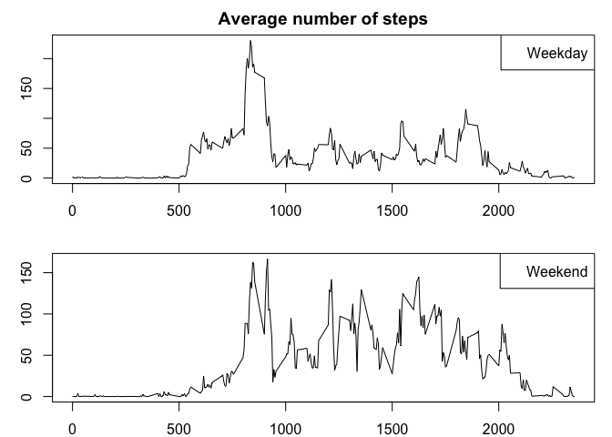

# Reproducible Research: Peer Assessment 1


## Loading and preprocessing the data

```r
# Read the csv file
activity <- read.csv("activity.csv",header=TRUE)
# Adjust the date
activity$date <- as.Date(activity$date)
```

## What is mean total number of steps taken per day?

```r
# Calculate total number of steps taken on each day
total_steps_per_day <- as.integer(with(activity,tapply(steps,date,sum,na.rm=TRUE)))
hist(total_steps_per_day,breaks=10,col="gray",
     xlab="Number of steps per day", main = "Histogram of total steps taken per day")
```



```r
cat("Mean of total steps per day : ", mean(total_steps_per_day))
```

```
## Mean of total steps per day :  9354.23
```

```r
cat("Median of total steps per day : ",median(total_steps_per_day))
```

```
## Median of total steps per day :  10395
```

## What is the average daily activity pattern?

```r
# Average daily activity pattern
total_steps_per_interval <- with(activity,tapply(steps,interval,sum,na.rm=TRUE))
plot(names(total_steps_per_interval),total_steps_per_interval,type="l",
     xlab="Interval",ylab="Average steps",
     main="Average steps across all days per 5 minute interval")
```



```r
cat("Maximum average steps across all days occur at inteval : ", names(total_steps_per_interval)[which.max(total_steps_per_interval)])
```

```
## Maximum average steps across all days occur at inteval :  835
```


## Imputing missing values

```r
cat("Number of missing values : ", sum(is.na(activity$steps)))
```

```
## Number of missing values :  2304
```

Check how the NA values are distributed on a day basis. Note each day has at max 288 entries

```r
with(activity,tapply(steps,date,function(x) {sum(is.na(x))}))
```

```
## 2012-10-01 2012-10-02 2012-10-03 2012-10-04 2012-10-05 2012-10-06 
##        288          0          0          0          0          0 
## 2012-10-07 2012-10-08 2012-10-09 2012-10-10 2012-10-11 2012-10-12 
##          0        288          0          0          0          0 
## 2012-10-13 2012-10-14 2012-10-15 2012-10-16 2012-10-17 2012-10-18 
##          0          0          0          0          0          0 
## 2012-10-19 2012-10-20 2012-10-21 2012-10-22 2012-10-23 2012-10-24 
##          0          0          0          0          0          0 
## 2012-10-25 2012-10-26 2012-10-27 2012-10-28 2012-10-29 2012-10-30 
##          0          0          0          0          0          0 
## 2012-10-31 2012-11-01 2012-11-02 2012-11-03 2012-11-04 2012-11-05 
##          0        288          0          0        288          0 
## 2012-11-06 2012-11-07 2012-11-08 2012-11-09 2012-11-10 2012-11-11 
##          0          0          0        288        288          0 
## 2012-11-12 2012-11-13 2012-11-14 2012-11-15 2012-11-16 2012-11-17 
##          0          0        288          0          0          0 
## 2012-11-18 2012-11-19 2012-11-20 2012-11-21 2012-11-22 2012-11-23 
##          0          0          0          0          0          0 
## 2012-11-24 2012-11-25 2012-11-26 2012-11-27 2012-11-28 2012-11-29 
##          0          0          0          0          0          0 
## 2012-11-30 
##        288
```
Since NA values on these specific days correspond to data not being available in any of the intervals, any sort of imputing isn't going to change the results.

In other words, when data is missing on a specific day, it is missing across all the intervals of that day thereby any imputing based on mean/median would still yeild a NA result.

Check how NA values are distributed on an interval basis. Note each interval has at max 61 days of data

```r
with(activity,tapply(steps,interval,function(x) {sum(is.na(x))}))
```

```
##    0    5   10   15   20   25   30   35   40   45   50   55  100  105  110 
##    8    8    8    8    8    8    8    8    8    8    8    8    8    8    8 
##  115  120  125  130  135  140  145  150  155  200  205  210  215  220  225 
##    8    8    8    8    8    8    8    8    8    8    8    8    8    8    8 
##  230  235  240  245  250  255  300  305  310  315  320  325  330  335  340 
##    8    8    8    8    8    8    8    8    8    8    8    8    8    8    8 
##  345  350  355  400  405  410  415  420  425  430  435  440  445  450  455 
##    8    8    8    8    8    8    8    8    8    8    8    8    8    8    8 
##  500  505  510  515  520  525  530  535  540  545  550  555  600  605  610 
##    8    8    8    8    8    8    8    8    8    8    8    8    8    8    8 
##  615  620  625  630  635  640  645  650  655  700  705  710  715  720  725 
##    8    8    8    8    8    8    8    8    8    8    8    8    8    8    8 
##  730  735  740  745  750  755  800  805  810  815  820  825  830  835  840 
##    8    8    8    8    8    8    8    8    8    8    8    8    8    8    8 
##  845  850  855  900  905  910  915  920  925  930  935  940  945  950  955 
##    8    8    8    8    8    8    8    8    8    8    8    8    8    8    8 
## 1000 1005 1010 1015 1020 1025 1030 1035 1040 1045 1050 1055 1100 1105 1110 
##    8    8    8    8    8    8    8    8    8    8    8    8    8    8    8 
## 1115 1120 1125 1130 1135 1140 1145 1150 1155 1200 1205 1210 1215 1220 1225 
##    8    8    8    8    8    8    8    8    8    8    8    8    8    8    8 
## 1230 1235 1240 1245 1250 1255 1300 1305 1310 1315 1320 1325 1330 1335 1340 
##    8    8    8    8    8    8    8    8    8    8    8    8    8    8    8 
## 1345 1350 1355 1400 1405 1410 1415 1420 1425 1430 1435 1440 1445 1450 1455 
##    8    8    8    8    8    8    8    8    8    8    8    8    8    8    8 
## 1500 1505 1510 1515 1520 1525 1530 1535 1540 1545 1550 1555 1600 1605 1610 
##    8    8    8    8    8    8    8    8    8    8    8    8    8    8    8 
## 1615 1620 1625 1630 1635 1640 1645 1650 1655 1700 1705 1710 1715 1720 1725 
##    8    8    8    8    8    8    8    8    8    8    8    8    8    8    8 
## 1730 1735 1740 1745 1750 1755 1800 1805 1810 1815 1820 1825 1830 1835 1840 
##    8    8    8    8    8    8    8    8    8    8    8    8    8    8    8 
## 1845 1850 1855 1900 1905 1910 1915 1920 1925 1930 1935 1940 1945 1950 1955 
##    8    8    8    8    8    8    8    8    8    8    8    8    8    8    8 
## 2000 2005 2010 2015 2020 2025 2030 2035 2040 2045 2050 2055 2100 2105 2110 
##    8    8    8    8    8    8    8    8    8    8    8    8    8    8    8 
## 2115 2120 2125 2130 2135 2140 2145 2150 2155 2200 2205 2210 2215 2220 2225 
##    8    8    8    8    8    8    8    8    8    8    8    8    8    8    8 
## 2230 2235 2240 2245 2250 2255 2300 2305 2310 2315 2320 2325 2330 2335 2340 
##    8    8    8    8    8    8    8    8    8    8    8    8    8    8    8 
## 2345 2350 2355 
##    8    8    8
```
Bingo. This is the way to go. Pick mean of remaining data across other days in that interval and asssing it to missing intervals

```r
# Substitue missing values with mean value of that interval
new_activity <- activity
mean_steps_per_interval <- with(activity,tapply(steps,interval,mean,na.rm=TRUE))
U <- which(is.na(new_activity$steps))
new_activity$steps[U] <- mean_steps_per_interval[as.character(new_activity$interval[U])]
```
Done imputing the data. Missing values are replaced with mean steps of the interval in which the current NA value belongs.

```r
#histogram
total_steps_per_day_new <- as.integer(with(new_activity,tapply(steps,date,sum,na.rm=TRUE)))
hist(total_steps_per_day_new,breaks=10,col="gray",
     xlab="Number of steps per day", 
     main = "Histogram of total steps taken per day - after Imputing")
```



```r
cat("Mean of total steps per day (after imputing): ", mean(total_steps_per_day_new))
```

```
## Mean of total steps per day (after imputing):  10766.16
```

```r
cat("Median of total steps per day (after imputing): ",median(total_steps_per_day_new))
```

```
## Median of total steps per day (after imputing):  10766
```

## Are there differences in activity patterns between weekdays and weekends?

```r
U <- weekdays(new_activity$date) %in% c("Saturday","Sunday")
new_activity$day <- NA
new_activity$day[U] <- as.character("Weekend")
new_activity$day[!U] <- as.character("Weekday")

weekday <- new_activity[new_activity$day=="Weekday",]
weekday_mean_steps <- with(weekday,tapply(steps,interval,mean,na.rm=TRUE))

weekend <- new_activity[new_activity$day=="Weekend",]
weekend_mean_steps <- with(weekend,tapply(steps,interval,mean,na.rm=TRUE))

par(mfrow=c(2,1),mar=c(2,3,2,1))
plot(names(weekday_mean_steps),weekday_mean_steps,type="l",xlab="Interval", main="Average number of steps")
legend("topright",legend="Weekday")
plot(names(weekend_mean_steps),weekend_mean_steps,type="l",xlab="Interval")
legend("topright",legend="Weekend")
```


